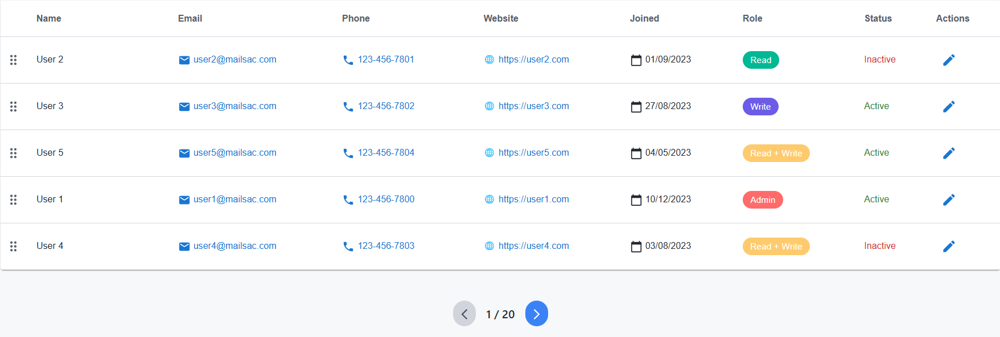
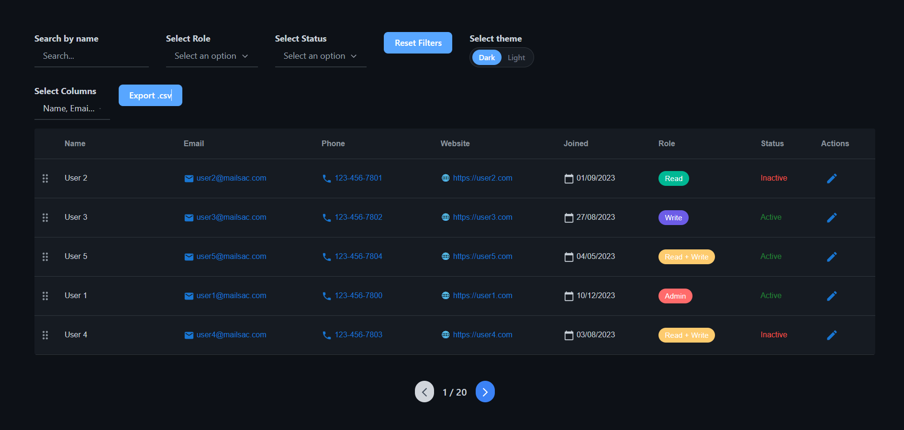
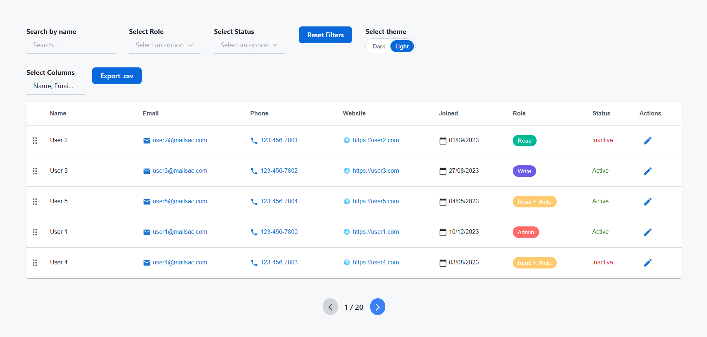
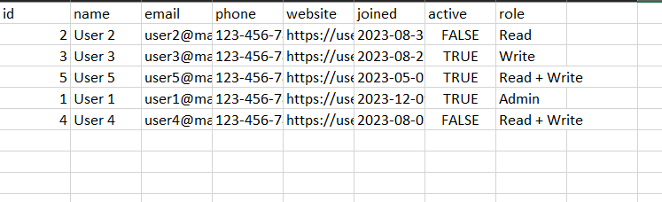

# BIZMORPHIC ASSIGNMENT

A dynamic CRM table interface built using **React**, **Redux**, and **Tailwind CSS**. This project supports drag-and-drop row ordering, inline editing, dynamic column management, CSV export, and advanced filtering.

🔗 **Live Demo:** [https://your-deployment-url.com](https://your-deployment-url.com)


## ✨ Features

- 🔍 Search and filter by status and role
- 🧩 Column toggle (show/hide specific fields)
- 📤 Export data to CSV
- ✏️ Inline editing with validation
- 🔄 Drag and drop rows to reorder
- 📆 Date input with validation
- 🎨 Role chips with distinct colors
- 💡 Theme support via custom colors
- 📱 Responsive UI

---

## 📁 Folder Structure

```
src/
├── components/
│ ├── Button/
│ ├── Chips/
│ ├── Dropdown/
│ ├── MultiSelectDropdown/
│ ├── Pagination/
│ ├── Search/
│ ├── Table/
│ └── ToggleSwitch/
├── data/
│ ├── colors.js # Theme-related colors
│ └── mockData.js # Static mock data
├── pages/
│ ├── Home/ # Home page with table view
│ └── UserDetail/ # User detail page (Linked from row)
├── redux/
│ ├── action/
│ ├── reducer/
│ └── store.js # Redux store setup
├── Utils/
│ └── utils.js # Utility functions
├── App.js
├── index.js
```


---

## 🚀 Getting Started

### Prerequisites

- Node.js (>= 14)
- npm

### Installation

```bash
git clone https://github.com/amitmishrra/bizmorphic-assignment
cd bizmorphic-assignment
npm install
```
### Running the App

```
npm start
```

## 🖼️ Screenshots

Table With pagination


Dark Theme


Light Theme


Exported csv File
